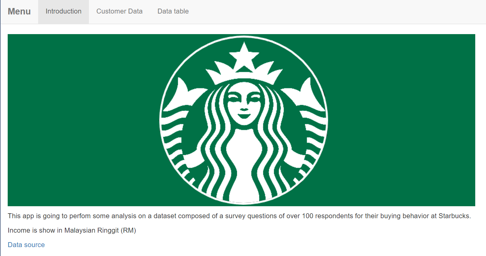
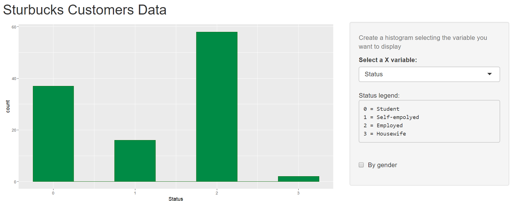
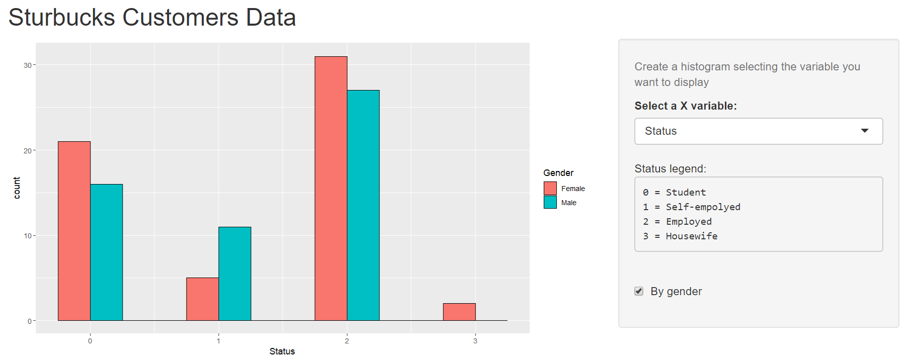
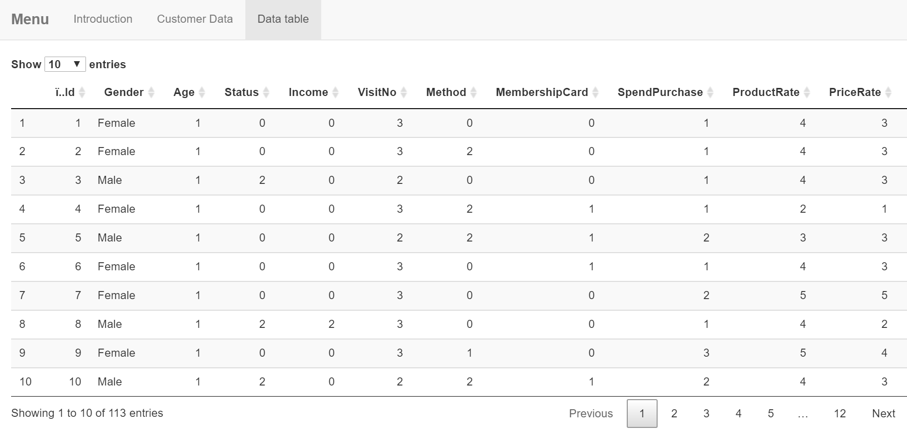

# Sarbucks data visualizator

This shiny app has been made for the midterm exam of the second module of the course *Coding for Data Science*.

To run it copy and paste this: ```runGitHub("shiny_mid_exam", "elisa98mars", ref="main") ```


## Introduction panel

Here you can find the logo of the company and a breif descriptrion of the dataset used, that you can find [here](https://www.kaggle.com/mahirahmzh/starbucks-customer-retention-malaysia-survey).




## Customer Data panel

In this panel you can visualize an histogram of which you can choose the **x variable** to visualize. 



In addition you can choose if to visualized the data divided **by gender**, checking the appropriate box, or **by membership** checking the other box.




## Data table panel

In the last panel you can find a table with all the data used.




## Variables

Below are listed the variable of the dataset used and their meaning.

**Id** -> a numerical variable to identify each single customer.

**Gender** -> dummy variable: M for male, F for female.

**MembershipCard** -> dummy variable: Yes or No.

**Age** -> 0 = Below 20, 1 = 20-29, 2 = 30-39, 3 = 40 and above

**Status** -> 0 = Student, 1 = Self-empolyed, 2 = Employed, 3 = Housewife

**Income** -> 0 = Less than 25,000 RM, 1 = 25,000 RM - 50,000 RM, 2 = 50,000 RM - 100,000 RM, 3 = 100,000 RM - 150,000 RM, 4 = More than 150,000 RM

**VisitNo** -> 0 = Daily, 1 = Weekly, 2 = Monthly, 3 = Never

**Method** -> 0 = Dine-in, 1 = Drive-thru, 2 = Take-away, 3 = Never, 4 = Others

**SpendPurchase** -> 0 = Zero, 1 = Less than 20 RM, 2 = 20 RM - 40 RM, 3 = More than 40 RM

The remaining varibles are about the **rate** the customer left on some charcteristics of their experience; the votes go from 1 to 5, where 1 is *very bad* and 5 is *excellent*.
